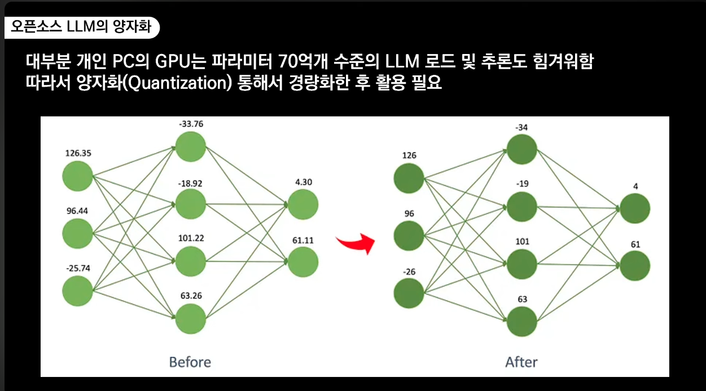
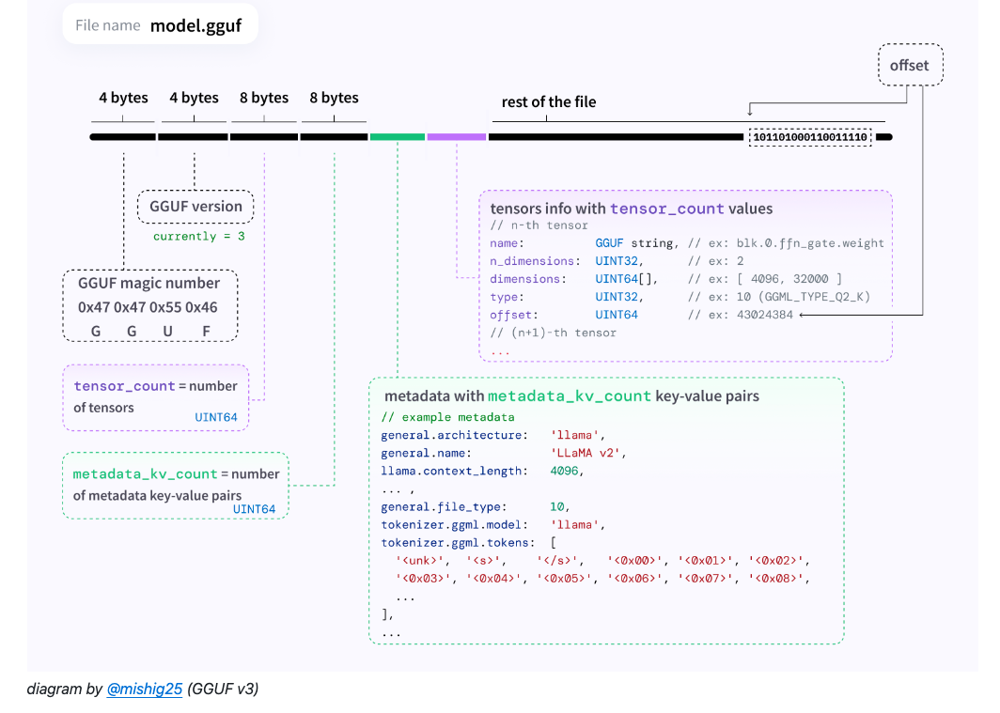

# Jupyter Notebook

## 주피터 노트북이란

주피터 노트북은 웹 기반의 대화형 개발 환경(IDE)으로, 코드 실행, 텍스트 작성, 시각화 등을 하나의 문서에서 수행할 수 있는 오픈소스 도구

### 주요 특징

- 코드와 결과물을 실시간으로 확인 가능
- 마크다운을 통한 문서화 지원
- 40개 이상의 프로그래밍 언어 지원이라 하지만 거의 `파이썬`
- 데이터 시각화, 인공지능 라이브러리: numpy, matplotlib, torch등

### 주피터 노트북 주요 사용자층

1. ML 엔지니어/연구원 머신러닝/딥러닝 모델 개발 하이퍼파라미터 튜닝 모델 학습 과정 시각화 실험 결과 비교 및 문서화 PyTorch, TensorFlow 등 ML 프레임워크 활용
2. 데이터 사이언티스트 데이터 전처리 및 탐색적 데이터 분석(EDA) 데이터 시각화 통계 분석 가설 검증
3. 연구원/학계 연구 결과 문서화 실험 데이터 분석 논문 작성을 위한 그래프/차트 생성 재현 가능한 연구 환경 구축
4. 교육자 프로그래밍 교육 대화형 학습 자료 제작 ML/DL 실습 자료 제작
5. 엔지니어 프로토타입 개발 코드 테스트 및 디버깅 API 테스트

**ML 분야에서 주피터 노트북이 선호되는 이유** : 코드 실행 결과를 즉시 확인 가능 실험 과정과 결과를 체계적으로 문서화 시각화 도구를 통한 모델 성능 분석 용이 재현 가능한 실험 환경 제공 GitHub에서의 코드 공유 및 협업 편리

## 설치

### anaconda

데이터 과학 및 머신러닝을 위한 파이썬 배포판으로, 많은 패키지들이 미리 설치되어 있는 통합 개발 환경

- 1,500+ 오픈소스 패키지 포함
- 패키지 및 환경 관리 용이
- 가상환경을 통한 프로젝트별 독립적인 개발 환경 구축

#### 가상환경 관리

- 가상환경(Virtual Environment) 생성 및 관리가 용이
- 프로젝트별로 다른 파이썬 버전과 패키지를 사용 가능
- 의존성 충돌 문제 해결에 도움

#### 주요 포함 도구

- Jupyter Notebook/Lab: 대화형 개발 환경
- Spyder: 파이썬 통합개발환경(IDE)
- NumPy, Pandas, Matplotlib 등 데이터 분석 라이브러리
- scikit-learn: 머신러닝 라이브러리

```bash
# brew 설치
brew install --cask anaconda

# 버전확인
conda --version

# 가상환경 생성
conda create -n jupyter python=3.11.0

# zsh or bash profile 추가
conda init zsh (or bash)

# 활성화
conda activate jupyter

# 비활성화
conda deactive

# ipykernel 설치
pip install ipykernel

# 커널 추가
python -m ipykernel install --user --name=jupyter


# 주피터 노트북 실행
jupyter lab
```

## 1:1 문의 카테고리별 카운팅

```python
import mysql.connector
import plotly.graph_objects as go

# MySQL 연결
conn = mysql.connector.connect(
    host='10.104.17.79',
    database='cos_alpha',
    user='cos_alpha',
    password='zh0tmdkfvk!DB',
    port= '13306'
)

# 커서 생성
cursor = conn.cursor(dictionary=True)

# 쿼리 실행
cursor.execute("""
select cqc.category_name, count(1) as cnt
  from cos_qna a
 inner join cos_qna_category cqc on a.cos_qna_category_no = cqc.cos_qna_category_no
 group by cqc.category_name
""")

# 결과 가져오기
data = cursor.fetchall()

# 카테고리와 건수를 별도 리스트로 분리
categories = [item['category_name'] for item in data]
counts = [item['cnt'] for item in data]

# 바차트 생성
fig = go.Figure(go.Bar(
    x=counts,
    y=categories,
    orientation='h',
    marker=dict(
        color='rgb(55, 83, 109)',
        line=dict(color='rgb(8,48,107)', width=1.5)
    )
))

# 차트 레이아웃 설정
fig.update_layout(
    title='카테고리별 건수',
    title_x=0.5,  # 제목 중앙 정렬
    xaxis_title='건수',
    yaxis_title='카테고리',
    width=800,
    height=1500,
    font=dict(
        family="AppleGothic",  # 한글 폰트 설정
        size=12
    ),
    showlegend=False,
)


# 차트 표시
fig.show()


# 연결 종료
cursor.close()
conn.close()


```

<<<<<<< HEAD
# Ollama: 로컬 LLM 실행 도구

## 소개

Ollama는 로컬 환경에서 대규모 언어 모델(LLM)을 쉽게 실행할 수 있는 오픈소스 도구입니다.

## 주요 특징

- 다양한 오픈소스 AI 모델 지원
- 간단한 CLI 인터페이스
- 로컬 환경 GPU/CPU 호환
- 모델 관리 용이성

## 설치 방법

### macOS 설치

```bash
brew install --cask ollama

# 코드라마 실행
ollama run codellama:7b

# chatgpt같은 web ui
docker run -d -p 3000:8080 --add-host=host.docker.internal:host-gateway -v open-webui:/app/backend/data --name open-webui --restart always ghcr.io/open-webui/open-webui:main
```

### CodeGPT

[intellij plugin](https://plugins.jetbrains.com/plugin/21056-codegpt)

[ollama github](https://github.com/ollama/ollama?tab=readme-ov-file)
=======
## ollama

Ollama는 로컬 환경에서 대규모 언어 모델(LLM)을 쉽게 실행할 수 있게 해주는 오픈소스 프레임워크입니다.

1. 주요 기능:

- 로컬 환경에서 LLM 모델 실행 가능
- 다양한 오픈소스 모델 지원 (Llama 3, Code Llama, Mistral 등)
- 간단한 명령어로 모델 다운로드 및 실행
- API 제공으로 애플리케이션 개발 가능

2. 장점:

- 인터넷 연결 없이 오프라인에서 사용 가능
- 데이터 프라이버시 보장
- 무료로 사용 가능
- 커스텀 모델 생성 지원

## 설치 & 실행

```bash
brew install ollama

# 라마3.2 실행
ollama run llama3.2
```

### huggingface

- Hugging Face는 AI 커뮤니티를 위한 중심 플랫폼으로, 머신러닝 분야에서 협업과 리소스 공유를 위한 가장 큰 허브
- AI계의 Docker Hub

[huggingface](https://huggingface.co/QuantFactory/llama-3.2-Korean-Bllossom-3B-GGUF/tree/main)

### GGUF

GGUF(GPT-Generated Unified Format)

1. GGUF 주요 특징

- GPT-Generated: GPT 모델을 위해 생성된
- Unified: 통합된
- Format: 파일 형식

2. 장점

- 이전 GGML 포맷의 개선 버전
- 더 나은 메타데이터 지원
- 향상된 성능과 호환성
- 더 작은 파일 크기
- 빠른 로딩 시간

3. 주요용도

- 큰 AI 모델을 효율적으로 압축
- 로컬 환경에서 실행 가능한 크기로 변환
- CPU에서 실행 가능
- 적은 메모리로 구동 가능
- 오프라인 환경에서 사용 가능
- 다양한 기기 지원
- 다양한 OS 지원

### 모델 파일명 의미

```plaintext
llama-3.2-Korean-Bllossom-3B.Q8_0.gguf
|     |    |      |       |  |   |  |
1     2    3      4       5  6   7  8
```

1. 기본 모델 아키텍처
2. 모멜 보전
3. 한국어 학습/튜닝 특화
4. 프로젝트명 or 특화된 버전, 특정팀/개발자 커스텀
5. 3b = 30억 파라미터 모델
6. Quantization 양자화 레벨
   1. Q8(8-bit) ~ Q3(3-bit) 가중치 압축
   2. 레벨이 높을수록 원본 모델과 가장 유사한 성능, 메모리 사용율도 증가
   3. 하드웨어 성능에 따라서 잘 선택해야함
   4. 메모리 사용량 예시 (7B 모델 기준)
```
Q8: ~8GB
Q6: ~6GB
Q5: ~5GB
Q4: ~4GB
Q3: ~3GB
```

[출처](https://www.youtube.com/watch?v=04jCXo5kzZE)

7. 버전

```plaintext
mistral-7b-v0.1-q4_K_M.gguf
- mistral-7b: 모델명과 크기
- v0.1: 버전
- q4: 4-bit 양자화
- K_M: 중간 크기 컨텍스트

llama-7b-q4_K_S.gguf
- llama-7b: 모델명과 크기
- q4: 4-bit 양자화
- K_S: 짧은 컨텍스트

mixtral-8x7b-v0.1-q3_K_L.gguf
- mixtral-8x7b: 모델명과 크기
- v0.1: 버전
- q3: 3-bit 양자화
- K_L: 긴 컨텍스트
```

- K(context size 관련 설정) = 1024Token
- 8K = 8,192Token K_M: Medium context length K_S: Short context length K_L: Long context length



### 한국어 특화 모델 설치 및 실행

[ollama Modelfile](https://github.com/ollama/ollama/blob/main/docs/modelfile.md)

```
FROM llama-3.2-Korean-Bllossom-3B-gguf-Q4_K_M

TEMPLATE """{{- if .System }}
<s>{{ .System }}</s>
{{- end }}
<s>Human:
{{ .Prompt }}</s>
<s>Assistant:
"""

SYSTEM """당신은 제 개인 비서 입니다. 한국말로 답변 부탁드립니다.
"""

PARAMETER stop <s>
PARAMETER stop </s>
```

## 검색 증강 생성
RAG : Retrieval-Augmented Generation

### LLM의 한계
- 편향성
- 사실 관계 오류 : 환각
- 맥락 이해 한계 : 장문의 글이나 복잡한 맥락
- 일관성 문제
- 윤리적 문제

### RAG 배경
- RAG는 LLM의 `사실 관계 오류`와 `맥락 이해 한계`를 극복함
- 외부 지식 활용
    - 대규모의 구조화된 지식 베이스를 모델에 연결
    - 주어진 질의에 대한 관련 정보를 지식 베이스에서 검색 및 추출
    - 예를 들어 우리 회사의 공지사항 데이터를 벡터DB에 저장 후 일반적인 한국말을 할줄 아는 LLM과을 이용하여 챗봇 구현
- 증거 기반 생성
    - 답변의 출처를 명시하여 신뢰도 향상
    - 검색된 지식 정보를 증거로 활용하여 특정 domain환경에서 사실에 기반한 답변 생성
- 맥락 이해력 향상
    - 외부 지식을 통해 질문에 대한 배경 지식과 맥락 정보 파악
- 실시간 정보 제공
    - 지식 검색과 답변 생성을 통합적으로 수행할 수 있는 Framework


**고품질, 고성능의 지식 베이스 구축이 중요**

### 핵심 요소
- 질의 인코더(Query Encoder): 사용자의 질문을 이해하기 위한 언어 모델입니다. 주어진 질문을 벡터 형태로 인코딩합니다.
- 지식 검색기(Knowledge Retriever): 인코딩된 질문을 바탕으로 외부 지식 베이스에서 관련 정보를 검색합니다. 예를 들어 Wikipedia, 뉴스 기사, 전문 서적 등 방대한 문서 집합에서 질문과 연관된 문단이나 구절을 찾아냅니다.
- 지식 증강 생성기(Knowledge-Augmented Generator): 검색된 지식을 활용하여 질문에 대한 답변을 생성하는 언어 모델입니다. 기존의 LLM과 유사하지만, 검색된 지식을 추가 입력으로 받아 보다 정확하고 풍부한 답변을 생성할 수 있습니다.


### 샘플
https://server-docs.godomall.com/

>>>>>>> 6727180 (blog)
