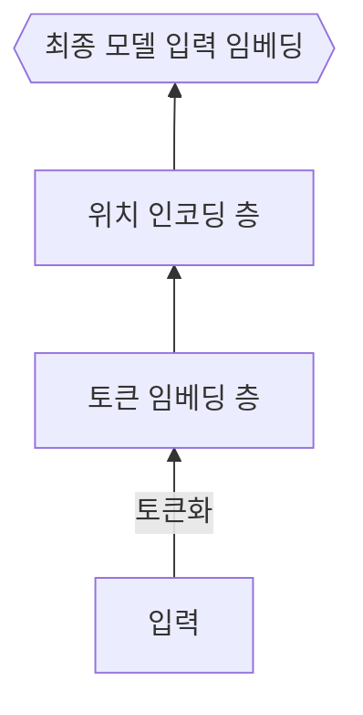

# LLM의 중추, 트랜스포머 아키텍처 살펴보기

- 이번 장에서는 트랜스포머 아키텍처를 코드 레벨에서 직접 구현해 보면서 세부적인 동작을 이해해 본다.
- 처음 접했을떄 직관적으로 이해하기 어렵고 복잡도가 높다.
- 언어를 이해하는 `인코더(encoder)`와 언어를 생성하는 `디코더(decoder)` 부분으로 나뉘며 자연어 처리 모델은 이중 어떤 부분을 사용하느냐에 따라 세 가지 그룹으로 나뉜다.

## 트랜스포머 아키텍처

- RNN 순차처리 방식을 버리고 `셀프 어텐션(self_attention)`이라는 개념을 도입
- 셀프 어텐션은 입력된 문장 내 각 단어가 서로 어떤 연관이 있는지 계산하여 각 단어의 `표현presentation`을 조정함

### 트랜스포머 아키텍처 장점

- 확장성 : 더 깊은 모델을 만들어도 학습이 잘됨 동일한 블록을 반복해 사용하기에 확장 용이
- 호율성 : 학습 시 병렬 연산 가
- 더 긴 입력 처리 : 입력이 길어져도 성능이 거의 떨어지지 않음 ** 트랜스포머가 있기에 대규모 언어 모델이 가능해졌음 **

## 설명


- 인코더(입력)와 디코더(출력)
- 입력을 토큰화(단어) 하여 임베딩(숫자로 변환)
- 위치 인코딩으로 `문장`의 위치 정보 추가
- `층 정규화(layer normalization)`, `멀티 헤드 어텐션`, `피드 포워드(feed forward)` 층을 거치며 문장을 이해
- 인코더 실행 후 결과를 디코더로 전달
- `정규화`, `멀티 헤드 어텐션` 연산 수행하면서 `크로스 어텐션` 연산을 통해 인코더가 전달한 데이터 출력과 함께 종합하여 `피드포워드`층을 거쳐 최종 결과 생성

### 텍스트를 임베딩으로 변환하기

텍스트르 모델에 입력할 수 있는 숫자형 데이터인 임베딩으로 변환하기 위해 크게 세가지 과정 필요

1. 적절한 단위로 잘라 숫자형 아이를 부여하는 `토큰화tokenization`
1. 토큰 아이디를 토큰 임베딩 층을 통해 여러 숫자의 집합인 `토큰 임베딩` 변환
1. `위치` 인코딩 층을 통해 토큰의 위치 정보를 담고 있는 `위치 임베딩` 추가



#### 토큰화

어떤 토큰이 어떤 숫자 아이디로 연결됐는지 기록해 둔 `사전(vocabulary)` 필요함

| 자모        | 음절      | 단어    |
| ----------- | --------- | ------- |
| ㅍ ㅏ ㄹ ㅣ | 파리      | 파리    |
| 작은 단위   | 중간 단위 | 큰 단위 |

- 큰 단위일 경우 의미가 잘 유지 된다는 장점이 있지만 사전의 크키가 커짐
- 이전에 본 적이 없는 새로운 단어는 사전에 없기 때문에 `OOV(Out of vocabulary)`문제가 자주 발생
- 작은 단위일 경우 OOV 문제 발생이 적지만 텍스트의 의미가 유지 되지 않음

최근에는 등장 빈도에 따라 토큰화 단위를 결정하는 `서브워드 subword` 토큰화 방식을 사용

- 자주 나오는 단어 단위는 유지 가끔 나오는 단어는 더 작은 단위로 나눠 텍스트 의미를 최대한 유지하면서 사전 크기를 작고 효율적으로 유지
- 한갈의 경우 보통 음절과 단어 사이에서 토큰화

| 작은단위 | -- >                   | 큰단위                                 |
| -------- | ---------------------- | -------------------------------------- |
| 자모     | 음절                   | 단어                                   |
| OOV방지  | 외국어, 특문, 이모티콘 | 자주 사용하는 표현, 국가이름, 유명인등 |

**자주 등장할수록 원래 형태 유지**

<script src="https://gist.github.com/chk386/86b8a22e9e7adbfcf473b0ce6ad43535.js"></script>

** 토큰화 코드 **

```python
# 띄어쓰기 단위로 분리
input_text = "나는 최근 파리 여행을 다녀왔다"
input_text_list = input_text.split()
print("input_text_list: ", input_text_list)

# 토큰 -> 아이디 딕셔너리와 아이디 -> 토큰 딕셔너리 만들기
str2idx = {word:idx for idx, word in enumerate(input_text_list)}
idx2str = {idx:word for idx, word in enumerate(input_text_list)}
print("str2idx: ", str2idx)
print("idx2str: ", idx2str)

# 토큰을 토큰 아이디로 변환
input_ids = [str2idx[word] for word in input_text_list]
print("input_ids: ", input_ids)
```
