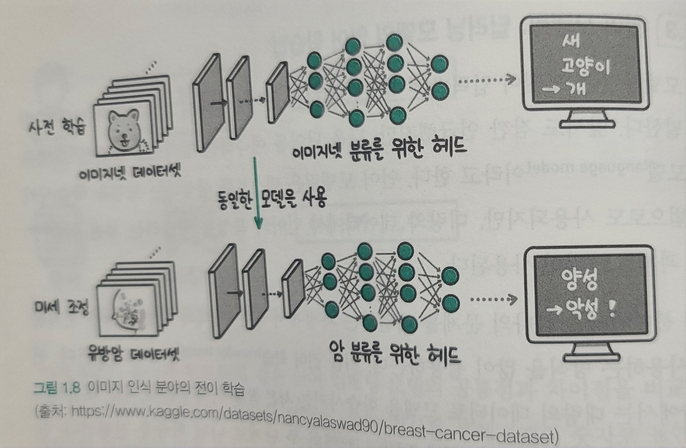
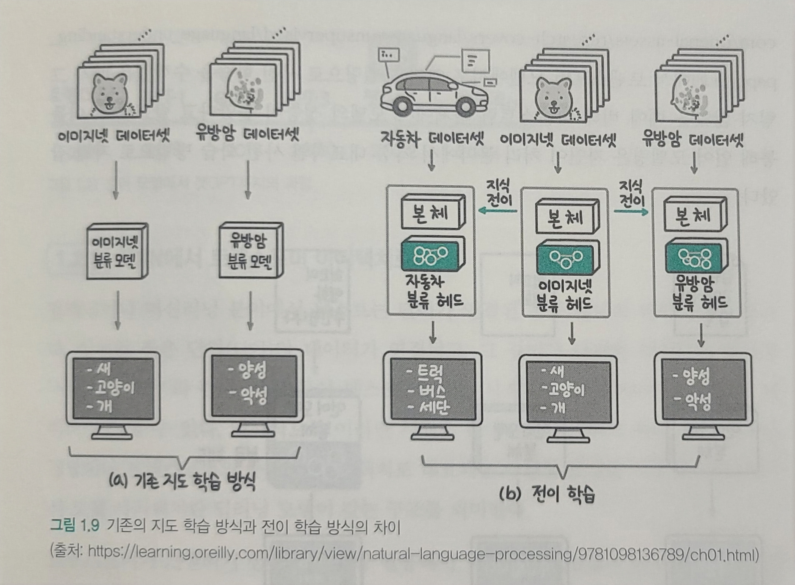
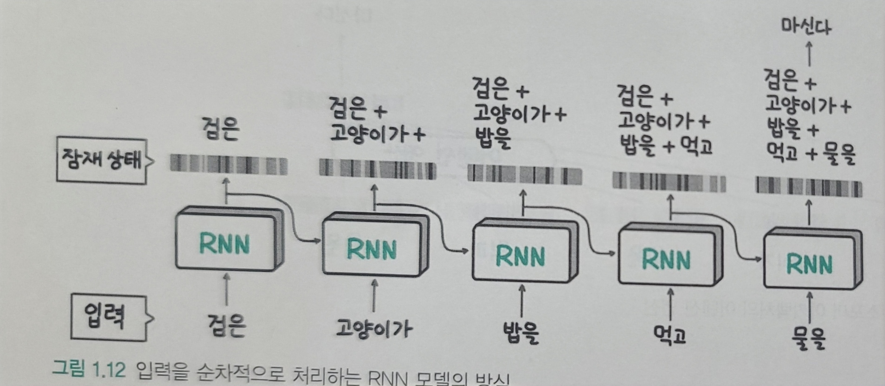
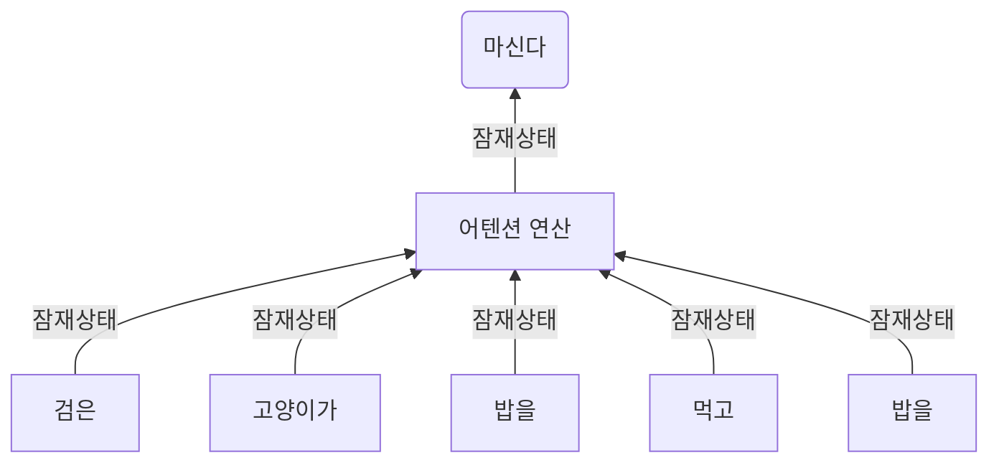
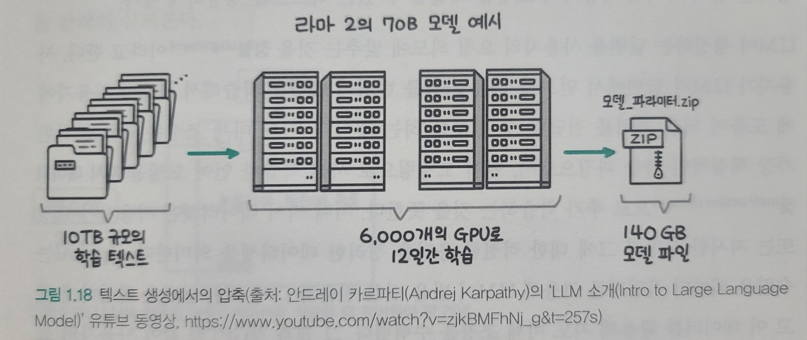
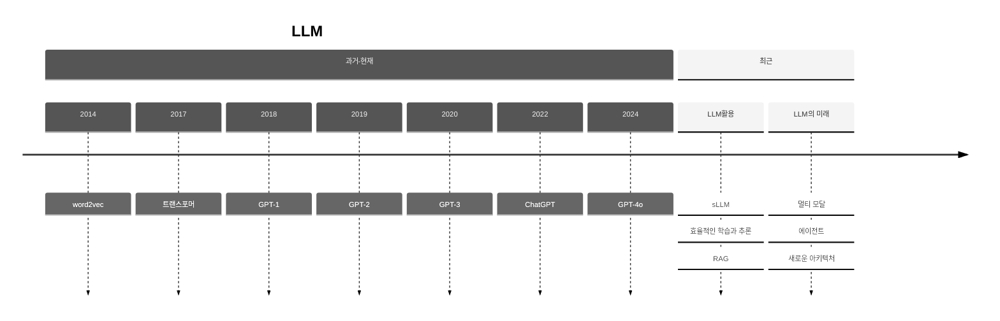

# LLM지도

## LLM이란?

- 대규모 언어 모델(Large Language Model)은 수많은 파라미터(수십억 wight)를 보유한 인공 신경망으로 구성 되는 언어 모델

## 3가지 작동 방식

### 토큰화

일반 인간 언어를 이해할 수 있는 시퀀스로 변화하는 작업을 의미(인코딩 작업), 문장 구조 예측하기 위한 학습 가이트 또는 공식과 같은 컨텍스트 백터 생성이 목적

### 트랜스포머 모델

순차적 데이터를 검사하여 어떤 단어가 서로 뒤따를 가능성이 높은지 관련 패턴을 식별하는 신경망의 일종으로 각각 다른 분석을 수행하여 어떤 단어가 호환되는지 결정하는 계층으로 구성된다. 이러한 모델은 언어를 학습하지 않고 알고리즘에 의존하여 사람이 쓴 단어를 이해하고 예를 들어, 힙스터 커피 블로그를 제공함으로써 커피에 대한 표준 글을 작성하도록 학습시킨다.

### 프롬프트

개발자가 정보를 분석하고 토큰화하기 위해 대규모 언어 모델 LLM에 제공하는 정보로 프롬프트는 기본적으로 다양한 사용 사례에서 LLM에 도움이 되는 학습 데이터이다. 더 정확한 프롬프트를 받을수록 LLM은 다음 단어를 더 잘 예측하고 정확한 문장을 구성할 수 있다. 따라서 딥러닝 AI의 적절한 학습을 위해서는 적절한 프롬프트를 선택하는 것이 중요하다.

[source](https://blog.naver.com/showtech00/223235508879)

## RAG 이란?

- 검색 증강 생성
- 기업 내부의 다양한 문서와 데이터를 임베딩이라는 기술을 활용해 벡터 데이터베이스로 지식 기반을 구축한 다음에 사용자가 질문하는 대답과 가장 관련이 있는 문서 조각을 지식 기반으로부터 뽑아내 LLM에게 요약 정리하게 만드는 방법으로 동작하는 애플리케이션을 의미한다.

## AI와 LLM 시장 키워드

- `Multi Modal` : 텍스트뿐 아니라 이미지, 음성, 동영상등 다양한 데이터 처리
  - OpenAI의 GPT-4o, Google의 Astra, Anthropic의 클로드 3.5 Sonnet
- `Agent`: 인터넷 검색, 코드 실행, 오피스와 같은 다양항 도구를 활용해 문제 해결하는 발전된 시스템
  - MS Copilot Agent
- `On-Device AI` : 사용자 장비에서 실행, 정보 유출 해결
  - Apple Intelligence, 네이밍 센스

# 1부 LLM 기초 뼈대 세우기

## 1. LLM 지도

ChatGPT는 굉장히 단순한 과정으로 동작한다. 주어진 입력에서 다음에 올 적잘한 단어를 확률적으로 선택(예측, 언어모델이라고 함)하고, 선택한 단어를 입력에 더해 문장이 끝날 때까지 선택하는 작업을 반복한다.

### 딥러닝과 언어 모델링

[출처](https://ictexpert.tistory.com/53)

- LLM은 기술적으로 딥러닝 기반
- Deep Learning이란 인간 두뇌에 영감을 받아 만들어진 neural network로서 데이터 패턴을 학습하는 머신러닝(기계학습)의 한 분야
- 표 형태의 정형 데이터뿐 아니라 텍스트, 이미지와 같은 비정형 데이터(unstructured data)에서도 뛰어난 패턴 인식 성능을 보임
- LLM은 사람의 언어를 컴퓨터가 이해하고 생성할 수 있도록 연구하는 자연어 처리(natural language processing)분야에 속함
- 특히 사람과 비슷하게 텍스트를 생성하는 방법을 연구하는 `자연어 생성(natural language generation)`이 LLM임
- 즉 LLM은 `딥러닝 기반의 언어 모델`

#### 데이터 특징을 스스로 추출하는 딥러닝

- 2012년 이미지 인식 대회인 이미지넷에서 딥러닝 모델인 알렉스넷이 우승
- 전년도 오류율 26%, 알렉스넷은 16%로 오류율로 충격을 줌
- 혁신적인 문제 해결 접근 방식
    1. 문제의 유형(이미지, 텍스트)에 따라 일반적으로 사용되는 모델 준비
    1. 풀고자 하는 문제에 대한 학습 데이터 준비
    1. 학습 데이터를 반복적으로 모델이 입력
- 이렇게 3단계만 거치면 문제 해결됨

[SOURCE](https://wooono.tistory.com/m/206)

#### 임베딩

- 딥러닝 모델은 데이터의 특징을 추출하는 방법도 함께 학습함
- 데이터의 의미를 숫자의 집합으로 표현함
- 책에서는 MBTI를 예를 들어 설명함
  - 세명의 사람이 각각 ENTP(0.7, 0.3, 0.8, 0.1) INTP(0.3, 0.2, 0.9, 0.2) ESFJ(0.8, 0.8, 0.2, 0.6) 숫자로 표현한다면 거리를 계산하여 유사도를 얻을 수 있음
- 거리를 계산할 수 있기에
    1. 검색어와 관련이 있는 상품을 추천 가능해짐
    2. 클러스터링 및 분류 : 유사하고 관련이 있는 데이터를 하나로 묶을수 있음
    3. 이상치(outlier)탐지 : 범위가 많이 벗어난 이상치를 탐지 할수 있음
- 데이터를 숫자로 변환하는 법 : [word2vec](https://arxiv.org/pdf/1411.2738)
- 단어를 word2vec 모델을 통해 숫자의 집합인 임베딩으로 변환함(word embedding)
- 단어 -> word2vec -> 0.1, 0.7, ...., 0.3
- 숫자 하나하나의 의미를 인간이 이해할수 없음. 숫자 집합 전체는 단어의 의미를 담고 있다는 사실은 인지 가능

#### 언어 모델링

- 딥러닝 분야에서는 하나의 문제를 해결하는 과정에서 얻은 지식과 정보를 다른 문제를 풀 때 사용하는 방식을 많이 활용함. `전이 학습(transfer learning)`
- 대량의 데이터로 모델을 학습시키는 `사전학습`과특정한 문제를 해결하기 위한 데이터로 추가 학습하는 `미세 조정(fine-tuning)` 두 단계로 나눠 학습을 진행
- 자연어 처리보다 먼저  `이미지 인식 분야`에서는 이미 학습된 모델을 필요한 과제에 맞춰 추가로 학습하는 전이 학습 개념이 널리 활용중이였음
  - 
  - 유방암이 양성인지 분류한는 문제를 풀때 유방암 데이터보다 사전 학습 모델을 활용했을때 성능이 더 높음
  - 사전 학습에 사용한 이미지가 현재 풀고자 하는 과제와 다르더라도 선이나 점 같은 특징을 파악하는 능력은 공통적으로 필요함
  - 이떄 사전 학습 모델을 미세 조정해 풀고자 하는 과제를 `다운스트림(downstream)`과제라고 부름
  - 더 적은 유방암 이미지만으로 높은 성능의 모델을 학습 시킬 수 있음
  - 머신러닝은 처음부터 끝까지 해결하려는 문제의 데이터로 학습하는 방식이나 딥러닝의 전이 합ㄱ습은 대량의 데이터 학습(사전 학습)과 현재 해결하려는 문제의 데이터로 추가 학습(미세조정)하는 두 단계로 모델을 학습시킴
- 아래 그림은 기존 지도 학습과 다르게 모델 본체는 대규모 데이터셋인 이미지넷으로 학습한 모델에서 가져오고 분류를 수행하는 헤드 부분은 해결하려는 작업의 데이터셋으로 추가 학습함
  - 
  - 헤드를 추가 학습하는 과정이 사전 학습에 비해 적은 양의 학습 데이터를 사용한다는 의미에서 `미세 조정(fine-tuning)`이라 불림
- 자연어 처리 분야의 전이학습
  - 2018년 fast.ai에서 다음 단어를 예측하는 언어 모델링 방식으로 사전 학습을 수행했을 때 훨씬 적은 레이블 데이터로도 기존 지도 학습 모델의 성능을 뛰어 넘는 사실을 발견
  - `트랜스포머 아키텍처`
  - [Universal Language Model Fine-tuning for Text Classification](https://arxiv.org/pdf/1801.06146)
  - 텍스트 데이터 레이블 없이 다음 단어 예측 방식으로 사전 학습에 활용할 수 있는 길이 열림
  - 순환신경망(RNN)에서 모델링 사전 학습 과제로 적합하다는 사실 확인
  - Google의 BERT, OpenAI GPT-1

### 언어 모델이 chat gpt가 되기까지

2017 : 트랜스포머
2018 : GPT-1
2019 : GPT-2
2020 : GPT-3
2022 : ChatGPT
2024 : GPT-4o

#### RNN -> 트랜스포머 아키텍처

- 텍스트는 단어가 연결된 문장 형태의 데이터를 말함
- 작은 단위(단어)의 데이터가 연결되고 길이가 다양한 데이터 형태를 `시퀀스`
- 시퀀스 데이터 처리를 위해 RNN과 트랜스포머로 대표되는 다양한 모델 사용
- 순환신경망 (RNN)
  - 이전 데이터를 기억, 다음 데이터의 입력으로 넣어 출력에 영향을 줄 수 있는 네트워크 구조
  - 시퀀스(문장)이나 연속적인 시계열 데이터에 사용
  - 특징
    - 모델이 간단
    - 큰 시퀀스 데이터도 처리 가능
    - 이전 정보 반영 : 아윤이가 포크를 들고 돈까스를 먹었다. -> 아윤이가 + 포크를 + 들고 + 돈까스를 이라는 이전 정보를 통해 `먹었다`를 예측 할수 있음.
    - `아윤이`와 `먹었다` 처럼 노드 위치가 먼 상태일 경우 문맥 처리가 힘듬
    - 먼저 입력한 단어가 점차 회석됨
    - 여러 단어로 구성된 맥락을 하나의 잠재 상태에 압축하기에 메모리 적게 사용
    - 다음 단어 예측시 지금까지 계산을 통해 만들어진 잠재 상태와 입력 단어만 있으면 되기 때문에 다음 단어 빠르게 생성
    - 

- 트랜스포머 아키텍처
  - 2017년 등장
  - 순차처리 방식 버림
  - 맥락을 모두 참조하는 어텐션(attention)연산을 사용하여 문제 대부분 해결
  - 맥락 데이터 그대로 모두 활용하여 다음 단어 예측
  - 아래와 같이 맥락을 압축하지 않고 그대로 활용하기 때문에 성능을 높일 수 있지만 메모리 사용량이 증가
  - 입력이 길면 시간도 증가, 많은 연산량이 필요하지만 순차적인 RNN과 달리 병렬 처리가 가능
  - 현재 대부분의 LLM은 트랜스포터 아키텍처 기반임

#### GPT시리즈로 살펴보는 모델 크기&성능 관계

| Release Date | Version| Parameter Count|-|
| --------------- | --------------- | --------------- | --------------- |
| 2018.06.11 | GPT-1 | 1.17억 | |
| 2019.02.14 | GPT-2 |  15억 | |
| 2020.06.11 | GPT-3 | 1,750억 | 인간 언어 생성 능력과 유사|

OpenAI의 GPT는 모델 구조 큰 변경 없이 오직 모델과 학습 데이터셋의 크기만 키웠음. 이렇게 간단한 접근 방식으로 언어 모델 성능이 크게 높아짐.

학습 데이터와 언어 모델의 결과가 모두 `생성된 언어`이며 따라서 언어 모델이 학습하는 과정을 학습 데이터를 압축하는 과정으로 생각할 수 있다.
무손실 압축이 아니라 중요 패턴을 남기는 손실 압축이며 Meta의 라마2 의 경우 약 10TB 텍스트로 학습해 최종적으로 140GB 크기의 모델이 된다. 학습 데이터 대비 `약 1.4%`정도의 작은 모델에, 학습 데이터가 갖고 있던 텍스트 생성의 패턴을 압축하였다.

#### ChatGPT 두둥등장

- GTP-3는 사용자의 말을 이어서 작성하는 능력밖에 없었음
- ChatGPT는 `지도미세조정(supervised fine-tuning)과 RLHF(Reinforcement Learning from Human Feedback, 사람의 피드백을 활용한 강화 학습)`라는 기술을 [논문](https://arxiv.org/pdf/2203.02155)으로 발표
- 위 기술들을 통해 다음에 이어질 텍스트 생성이 아니라 사용자의 요청을 해결할 수 있는 텍스트 생성이 가능해짐

- 생성하는 답변을 사용자 요청 의도에 맞추는 것을 `정렬(alignment)`라고 함
- `지도 미세 조정`은 정렬을 위한 핵심적인 학습 과정이며 언어 모델링으로 사전 학습한 언어 모델을 `지시 데이터셋(instruction dataset)`으로 추가 학습하는 것을 뜻함. 지시 데이터셋은 사용자가 요청 또는 지시한 사항과 그에 대한 적절한 응답을 정리한 데이터셋을 의미 -> 수많은 데이터 작업자를 고용해 LLM이 받을 법한 질문과 그에 대한 답변을 작성하게 했으며 이를 활용 지도 미세 조정을 수행함.
- 사용자가 요청에 응답하는것이 항상 옳은가? -> 윤리적 문제
- 정확한 답변이라도 사용자가 더 쉽게 생성해준다거나 인종, 성별등 차별적 표현을 사용하지 않게 노력해야함

- OpenAI에서는 두 가지 답변 중 사용자가 더 선호하는 답변을 선택한 데이터셋(`선호 데이터셋`)을 구축 하였음. 이 선호 데이터셋으로 LLM의 답변을 평가하는 `리워드 모델(reward model)`을 만들고 LLM이 점점 더 높은 점수를 받을 수 있도록 추가 학습을 하는데, 이떄 `강화 학습(reinforcement learning)`을 사용하기 때문에 이 기술을 RLHF(사람의 피드백을 활용한 강화 학습)이라 부른다.

#### LLM Application 시대

- ChatGPT의 충격은 많은 기업, 조직에서 LLM을 활용한 애플리케이션을 개발하기 위해 노력중
- LLM이 큰 영향을 미치는 이유는 `다재다능함` 때문임
- 대부분의 지식 노동자가 수행하는 작업은 언어의 이해와 생성을 모두 포함하기에 자동화가 어려웠으나 LLM은 자연어 이해와 생성 성능이 모두 뛰어남
- `비교적 간단한 작업`에서 사람을 완전히 대체할 수 있어 많은 기대와 우려가 동시에 받고 있음

#### sLLM 더 작고 효율적인 모델 만들기

LLM 애플리케이션 개발 하는 2가지 방법

1. OpenAI의 GPT-4나 구글 제미나이와 같은 상업용 API를 사용
2. 오픈소스 LLM을 활용해 직접 LLM API를 생성해 사용하는 방법

- 상업용이 모델이 크고 범용 텍스트 생성 능력이 뛰어나지만 원하는 도메인의 데이터, 작업을 위한 데이터로 자유롭게 추가 학습할 수 있는 오픈소스 LLM의 장점도 있다.
- 추가 학습을 하는 경우 모델 크기가 작으면서도 특정 도메인에서 높은 성능을 보이는 모델을 만들 수 있으며 이를 `sLLM(small Large Language Model)`이라 함.
- 대표적으로 2024년 4월 메타의 라마-3, MS의 Phi-3를 오픈소스로 공개하였음.
- 특히 Phi-3 미니 모델은 38억개의 적은 파라미터로 강력한 언어 추론 능력을 보여주었음. 개선해야 될 점들이 남아있으나, 모바일 기기에서 chatGPT 무료 버전 수준의 서비스를 제공할 수 있다는 가능성을 보여줌.
- 텍스트 요청을 SQL로 변환하는 작업에서 GPT-4를 뛰어넘은 Defog.ai의 SQLCoder도 sLLM임.

#### 환각 현상에 대처하는 검색 증강 생성(RAG)

- `환각 현상`이란 잘못된 정보나 실제로 존재하지 않는 정보-를 만들어 내는 현상
- 정확한 이유는 알기 어렵지만 기본적으로 학습 데이터를 손실 압축해 그럴듯한 문장을 만들 뿐 어떤 정보가 사실인지, 거짓인지 학습한 적은 없어 특정 정보가 사실인지 판단할 능력이 없음
- 또한 압축하는 과정에서 비교적 드물게 등장하는 정보는 소실될 수 있으며 이런 영향으로 부정확한 정보를 생성하는 원인이 될 수도 있음
- 이런 문제를 줄이기 위해 RAG 기술 사용, 프롬프트에 LLM이 답변할때 필요한 정보를 미리 추가함으로써 문제를 줄임

### LLM의 미래

- 큰 세가지 흐름
    1. 더 다양한 형식의 데이터(이미지, 비디오, 오디오 등)을 입력, 출력도 여러 행태로 발전된 `멀티 모달`
    2. 텍스트 생성 능력을 사용해 계획을 세우거나 의사결정을 내리고 필요한 행동까지 수행하는 `에이전트`
    3. 트랜스포머 아키텍처를 `새로운 아키텍처`로 변경하여 더 긴 입력을 효율적으로 처리하는 연구

**지금의 LLM연구는 최첨단 LLM과 비교적 작은 sLLM으로 크게 분기되어 발전중**

