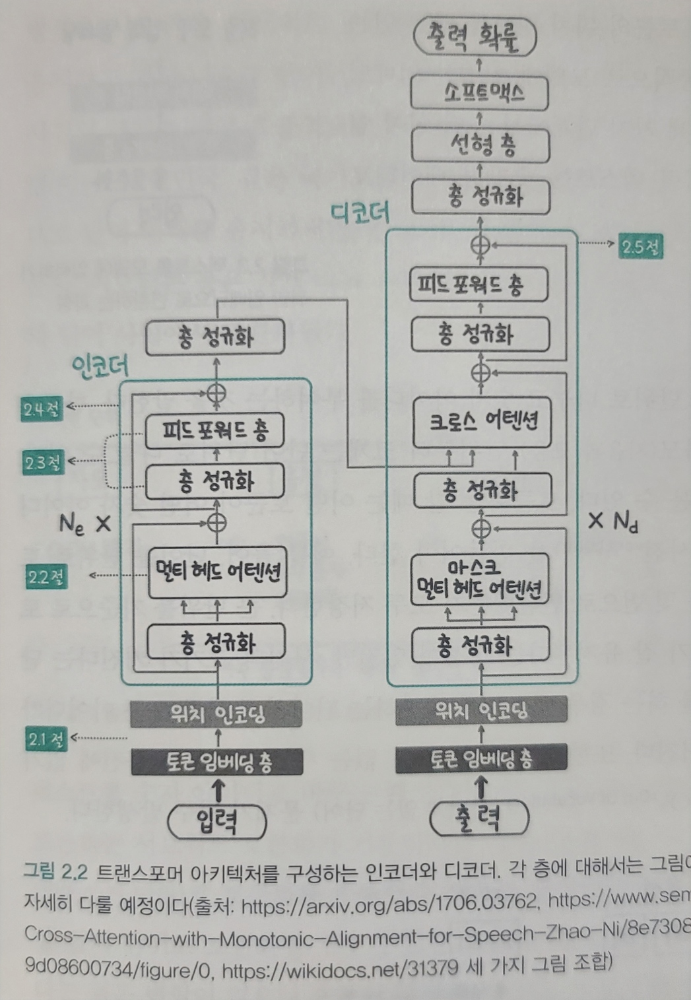

# LLM의 중추, 트랜스포머 아키텍처 살펴보기

- 이번 장에서는 트랜스포머 아키텍처를 코드 레벨에서 직접 구현해 보면서 세부적인 동작을 이해해 본다.
- 처음 접했을떄 직관적으로 이해하기 어렵고 복잡도가 높다.
- 언어를 이해하는 `인코더(encoder)`와 언어를 생성하는 `디코더(decoder)` 부분으로 나뉘며 자연어 처리 모델은 이중 어떤 부분을 사용하느냐에 따라 세 가지 그룹으로 나뉜다.

